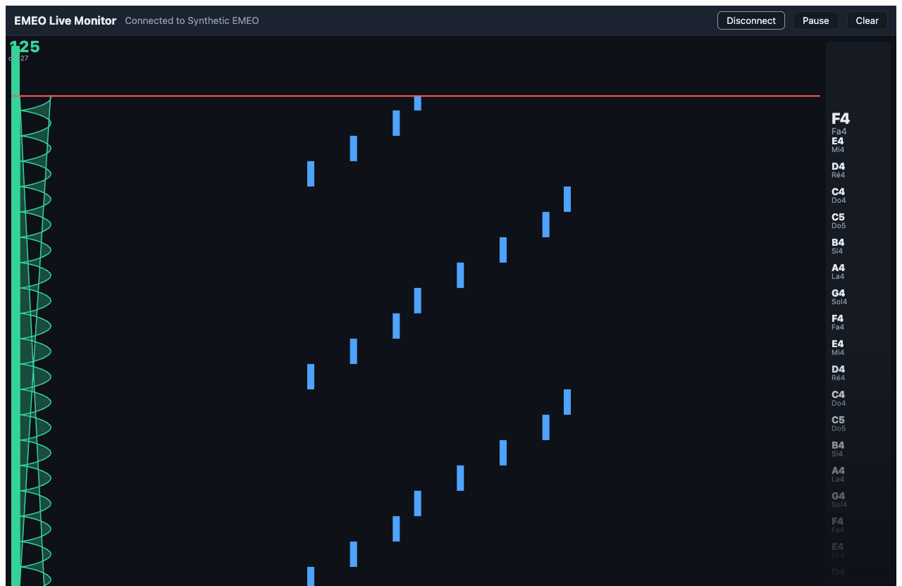

# EMEO Live Monitor

A browser app that connects to an **EMEO digital saxophone** over Web MIDI and shows, in real time,
**what you play** (the notes) and **how you blow** (the breath curve) — on one shared, downward-scrolling
time axis. Notes fall like Guitar Hero; the breath curve scrolls beside them; each note's name rides
alongside its block in both English (`A♯4`) and solfège (`La♯4`).



*Shown in synthetic demo mode — no hardware required; live playing from a real EMEO looks identical.*

It runs entirely in the browser. There is **no backend, no account, and no data storage** — nothing you
play leaves your machine.

This is the first of a planned family of EMEO practice tools (breath coach, sight-reading trainer,
analytics). Its connection and data layer are built as a reusable core the later tools will share.

---

## Requirements

- **A Chromium browser — Chrome or Edge.** Web MIDI is not available in Firefox or Safari. (Synthetic
  demo mode, below, works in any browser because it doesn't touch Web MIDI.)
- **Node.js** (any current LTS) and npm, to run the dev server.
- An **EMEO** connected by USB cable is the most reliable. Bluetooth works too, but you must pair the
  instrument in your operating system **first** — the browser cannot pair it for you.

---

## Quick start

```bash
npm install      # first time only
npm run dev      # starts the Vite dev server
```

Then open the printed URL — **http://localhost:5173/** — in Chrome or Edge.

> **Why `localhost` matters:** Web MIDI only works in a *secure context* — HTTPS or `localhost`.
> Connecting from the same machine at `localhost` counts as secure. Opening the app over a plain LAN
> address such as `http://192.168.x.x:5173` will **not** grant MIDI access, and the app will say so in
> plain language.

---

## Testing the app

### With a real EMEO

1. Plug the EMEO in **by cable**.
2. Open **http://localhost:5173/?debug** in Chrome or Edge. (Keep the `?debug` flag — it turns on the
   console MIDI log described below, which is how you see exactly what the instrument sends.)
3. Open the browser's **DevTools console** (`⌥⌘I` on macOS, `F12` on Windows) *before* connecting, so you
   catch the messages from the start.
4. Click **Connect** and allow MIDI access when the browser asks. If several instruments are listed,
   choose the EMEO.
5. Play. Notes light up and fall; the breath meter and curve respond; the console announces which control
   carries breath.

### Without hardware — synthetic demo mode

You can see the whole app working with no instrument, using a built-in fake that plays a scripted
performance:

**http://localhost:5173/?synthetic&debug** → click **Connect**.

Within ~2 seconds the breath readout starts counting, the curve scrolls, note blocks fall, and the console
prints `detected breath source: CC2` once. Useful for demos, for UI work, and for confirming your setup
before the real instrument arrives.

---

## URL flags

Append these to the address as query parameters (combine with `&`):

| Flag | Effect |
|------|--------|
| `?debug` | Turns on the console MIDI monitor and exposes a debug helper (see below). **Off by default** — leave it off in normal use; logging every breath message has a performance cost. |
| `?synthetic` | Replaces the real instrument with the built-in fake. No hardware or Web MIDI needed. |

Plain **http://localhost:5173/** with no flags is the real app: it shows *Not connected* and waits for an
actual EMEO.

---

## The debug console (`?debug`)

With `?debug` on, every incoming MIDI message is logged and the detected breath source is announced.

- **Raw messages log at `console.debug`, which Chrome hides by default.** To see the raw stream, open the
  console's **log-level filter** (the "Default levels" dropdown) and enable **Verbose**. Without this you'll
  see the breath-source verdict but an apparently empty message log. The app prints a one-line reminder of
  this when it connects.
- The detected breath source is announced **once** as `console.info`, followed by a scoreboard table — it
  won't drown in the message stream.
- **`window.__emeoResetBreathDetection()`** is available in the console (debug builds only). Call it to
  re-run breath-source detection without reloading — handy if the detector locked onto the wrong control
  (for example because a knob was nudged before you blew).

---

## Using the app

- **Connect / Disconnect / Reconnect** — top-left. The header always shows the current connection state,
  and explains failures in plain language (needs HTTPS, unsupported browser, permission declined, no
  instrument found, connection lost).
- **Notation** — every note shows **both** English and solfège names at once. There is no toggle; both are
  always visible.
- **Pause / Resume** — freezes the on-screen picture to study a phrase. The instrument keeps running
  underneath, so connection and breath detection stay live; resuming jumps to the present rather than
  replaying the gap.
- **Clear** — empties the stage for a fresh phrase. It does **not** disconnect, and it does **not** make
  you re-establish breath detection.

---

## Scripts

| Command | What it does |
|---------|--------------|
| `npm run dev` | Start the dev server (hot reload) at `http://localhost:5173/`. |
| `npm run build` | Type-check (`tsc -b`) and produce an optimized static build in `dist/`. |
| `npm run preview` | Serve the production build locally to check it before shipping. |
| `npm test` | Run the full test suite once (Vitest). |
| `npm run test:watch` | Run tests in watch mode. |
| `npm run lint` | Lint with oxlint. |

**Deployment:** `npm run build` emits a static site (`dist/`). Host it anywhere that serves over **HTTPS**
(Netlify, Vercel, Cloudflare Pages, GitHub Pages, …) — HTTPS is required for Web MIDI. There is no server
to run.

---

## How it works

The code is split so the instrument logic knows nothing about the screen:

- **`src/core/`** — the reusable core. Web MIDI access, a connection state machine, MIDI decoding,
  **runtime breath-source detection**, a fixed-capacity ring buffer, and an in-process event bus. It has
  no React dependency and never touches the DOM. Future EMEO tools import this unchanged. (A test enforces
  the boundary.)
- **`src/ui/`** — React components that *subscribe* to the core's event bus. The stage is drawn on a
  `<canvas>` by a `requestAnimationFrame` loop reading the ring buffer directly; note-name labels are DOM
  elements. **React never re-renders at frame rate** — breath samples go to the ring buffer, not to React
  state — so the display stays smooth even during fast playing.
- **`src/dev/syntheticEmeo.ts`** — the fake instrument behind `?synthetic`.
- **`src/debug/consoleLogger.ts`** — the `?debug` MIDI monitor.
- **`src/i18n/`** — UI text in English and French (auto-selected from the browser's language). Note names
  are *not* translations — they're a shared musical convention shown to everyone.

**Breath detection is done at runtime, not hard-coded.** Wind instruments variously send breath on MIDI
CC2, CC11, or channel pressure, and the EMEO's choice is not yet confirmed. The app watches the incoming
stream and locks onto whichever control behaves like breath (streams continuously across a wide range).
The `?debug` console tells you which one it picked.

---

## Testing & quality

- **Vitest** with jsdom. Run `npm test` — the suite covers pitch naming, the ring buffer, the event bus,
  MIDI decoding, breath detection, the connection state machine, the synthetic instrument, the geometry
  math, i18n, and the React components.
- `npm run build` also type-checks the whole project under TypeScript strict mode.

---

## Verifying against real hardware

No EMEO has been connected during development, so a few things about the instrument are genuinely unknown.
The app is built to answer them — connect a real EMEO with `?debug` and you can read off:

1. **Which control carries breath.** The console prints `detected breath source: …` (CC2 / CC11 / Channel
   Pressure). Blow steadily for ~2 seconds to trigger the lock.
2. **Written vs concert pitch.** Play a *written* C and see what note name appears. If it shows `E♭`, the
   EMEO transmits concert pitch; if `C`, written pitch. (A saxophone is a transposing instrument; this
   matters for the future sight-reading trainer.)
3. **Breath resolution.** Blow as hard as you comfortably can and read the peak number. If it never nears
   127, the instrument uses a narrower range.
4. **Extra data.** Watch the raw log (Verbose enabled) for other controls moving when you bite or change
   embouchure.
5. **Disconnect handling.** Unplug the cable mid-note — the header should report the connection lost, the
   curve should freeze rather than clear, and Reconnect should recover.

Findings from that first session get recorded in the design doc (`docs/superpowers/specs/…-design.md`, §12).

---

## Notable design decisions

The build made a few deliberate departures from the original functional spec, each recorded with its
reasoning in the design doc:

- The **raw MIDI monitor lives in the browser console** (behind `?debug`), not as an on-screen panel —
  the live meter and curve already show a user that data is flowing, leaving the console for developers.
- **Both note-name systems are shown at once**, so there is no notation toggle.
- The **breath curve is vertical**, sharing the notes' downward time axis, so you can see which breath
  shape produced which note.
- **Note history is the falling lane itself** rather than a separate list.

---

## Project documents

- `specifications/EMEO-Live-Monitor-Business-Spec.md` — what the product must do and why.
- `docs/superpowers/specs/2026-07-15-emeo-live-monitor-design.md` — how it's built, and the recorded
  decisions above.
- `docs/superpowers/plans/2026-07-15-emeo-live-monitor.md` — the task-by-task implementation plan.

---

## License

Copyright © 2026 Daniel De Luca

EMEO Live Monitor is free software: you can redistribute it and/or modify it under the terms of the
**GNU Affero General Public License** as published by the Free Software Foundation, either version 3
of the License, or (at your option) any later version. It is distributed in the hope that it will be
useful, but **without any warranty** — without even the implied warranty of merchantability or fitness
for a particular purpose. See the [full license text](LICENSE) for details.

Because this project is under the AGPL-3.0, one obligation is worth calling out: **if you run a
modified version of it as a network service, you must make your modified source available to that
service's users.** This is the clause (AGPL §13) that keeps hosted forks open.
